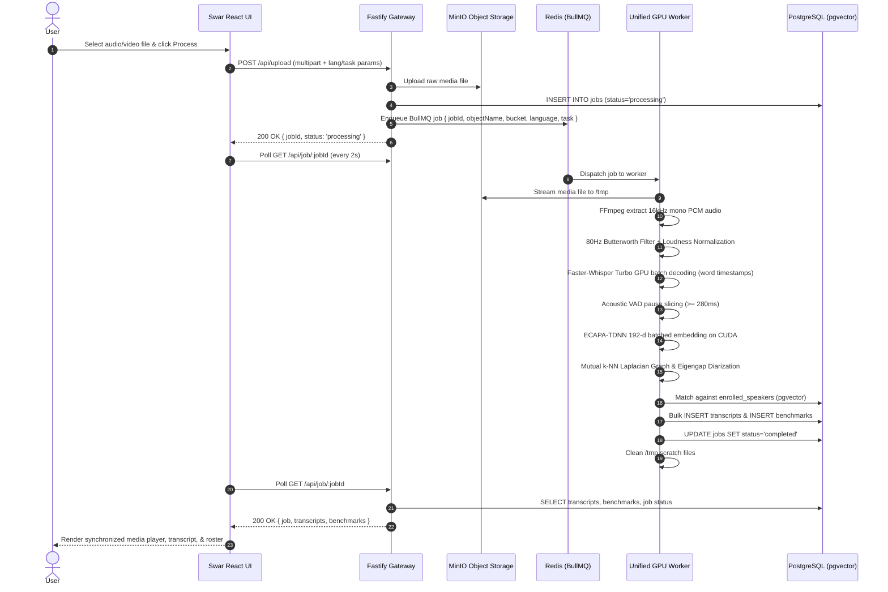

# Swar — System Architecture & Software Engineering Guide 🏛️

This document details the software architecture, microservices topology, asynchronous queue workflows, storage lifecycles, and database designs of **Swar**. It is written specifically for software engineers, backend developers, and systems architects.

---

## 🗺️ High-Level System Topology

Swar is built as an event-driven, containerized microservices platform running across six specialized services:

```text
                                  ┌───────────────────────────────┐
                                  │      Swar Web App          │
                                  │   (React + Vite + Vanilla CSS)│
                                  └───────────────┬───────────────┘
                                                  │ HTTP / JSON
                                                  ▼
                                  ┌───────────────────────────────┐
                                  │      Fastify API Gateway      │
                                  │     (Node.js / TypeScript)    │
                                  └───────┬───────────────┬───────┘
                                          │               │
                     ┌────────────────────┴───┐       ┌───┴───────────────────┐
                     ▼                        ▼       ▼                       ▼
            ┌─────────────────┐      ┌─────────────────┐     ┌─────────────────┐
            │   MinIO (S3)    │      │  PostgreSQL 15  │     │  Redis Broker   │
            │ 48h Auto-Expiry │      │   (+ pgvector)  │     │    (BullMQ)     │
            └────────┬────────┘      └────────┬────────┘     └────────┬────────┘
                     │                        │                       │
                     └────────────────────┐   │   ┌───────────────────┘
                                          ▼   ▼   ▼
                             ┌───────────────────────────────────┐
                             │        Unified GPU Worker         │
                             │  (PyTorch + Faster-Whisper Turbo  │
                             │    + SpeechBrain ECAPA-TDNN)      │
                             └───────────────────────────────────┘
```

---

## ⚙️ Service Catalog

| Service | Technology | Port / Network | Primary Responsibility |
| :--- | :--- | :--- | :--- |
| **`frontend`** | React 18, Vite, Vanilla CSS | `5173:5173` | Interactive media player, real-time transcript viewer, keyword search, subtitle export, speaker renaming, and voiceprint library UI. |
| **`backend`** | Node.js, Fastify, BullMQ, `pg` | `3000:3000` | REST API gateway, multipart upload handler, job state management, speaker renaming, GDPR deletion routes, and MinIO storage lifecycle controller. |
| **`worker_gpu`** | Python 3.10, PyTorch 2.2.1, CUDA 12.1 | Internal (`vad_net`) | GPU compute worker. Runs Whisper Turbo transcription, Silero VAD, ECAPA-TDNN feature extraction, and graph-based speaker clustering. |
| **`db`** | PostgreSQL 15, `pgvector` | `5434:5432` | Relational persistence for jobs, timestamps, transcripts, multi-sample 192-dimensional vector profiles, and GDPR audit trails. |
| **`redis`** | Redis 7.2 Alpine | `6381:6379` | High-throughput in-memory message broker powering BullMQ distributed job queues and locks. |
| **`minio`** | MinIO Object Storage (S3 API) | `9000:9000`, `9001:9001` | S3-compatible storage for raw audio/video files with automated 48-hour lifecycle purging rules. |

---

## 🔄 End-to-End Execution Pipeline



---

## 📊 Database Architecture (`vad_db`)

The database uses PostgreSQL 15 with the official `vector` extension (`pgvector`) for storing and querying 192-dimensional acoustic voiceprints.

```sql
-- 1. Jobs Table: Tracks the lifecycle state of all media jobs
CREATE TABLE jobs (
    id UUID PRIMARY KEY,
    status VARCHAR(50) NOT NULL,            -- 'processing', 'completed', 'error'
    video_length_secs FLOAT,
    created_at TIMESTAMP DEFAULT CURRENT_TIMESTAMP,
    updated_at TIMESTAMP DEFAULT CURRENT_TIMESTAMP
);

-- 2. Transcripts Table: Time-aligned sentence turns linked to speaker identities
CREATE TABLE transcripts (
    id SERIAL PRIMARY KEY,
    job_id UUID REFERENCES jobs(id) ON DELETE CASCADE,
    speaker_name VARCHAR(255),              -- 'Speaker 1', 'Raj Shamani', etc.
    text TEXT NOT NULL,
    start_time FLOAT NOT NULL,              -- Utterance start in seconds
    end_time FLOAT NOT NULL                 -- Utterance end in seconds
);
CREATE INDEX idx_transcripts_job_speaker ON transcripts(job_id, speaker_name);

-- 3. Benchmarks Table: Observability and latency breakdown
CREATE TABLE benchmarks (
    job_id UUID PRIMARY KEY REFERENCES jobs(id) ON DELETE CASCADE,
    upload_time_ms INT,
    gpu_time_ms INT,                        -- Whisper Turbo GPU inference time
    cpu_time_ms INT,                        -- ECAPA extraction & graph diarization time
    total_time_ms INT,                      -- Total wall-clock processing time
    detected_language VARCHAR(50),          -- 'en', 'hi', 'es', etc.
    detected_prob FLOAT,                    -- Model language confidence (0.0 to 1.0)
    num_speakers INT,                       -- Total unique speakers identified
    num_segments INT                        -- Total sentence segments
);

-- 4. Enrolled Speakers Table: Multi-sample biometric Gaussian voiceprints
CREATE TABLE enrolled_speakers (
    id SERIAL PRIMARY KEY,
    name VARCHAR(255) UNIQUE NOT NULL,
    embedding vector(192) NOT NULL,         -- 192-dimensional ECAPA centroid
    sample_count INT DEFAULT 1,             -- Number of samples aggregated
    created_at TIMESTAMP DEFAULT CURRENT_TIMESTAMP,
    updated_at TIMESTAMP DEFAULT CURRENT_TIMESTAMP
);

-- 5. Biometric Audit Logs: GDPR / CCPA regulatory compliance trail
CREATE TABLE voiceprint_audit_logs (
    id SERIAL PRIMARY KEY,
    speaker_name VARCHAR(255) NOT NULL,
    action VARCHAR(50) NOT NULL,            -- 'ENROLL', 'UPDATE', 'MATCH', 'DELETE'
    details TEXT,
    created_at TIMESTAMP DEFAULT CURRENT_TIMESTAMP
);
```

---

## 🛡️ Storage Lifecycle & Data Retention Architecture

Large video files (e.g. 2GB 4K recordings) can rapidly deplete disk storage if left indefinitely. Swar implements a **Tiered Retention Lifecycle**:

1. **Hot Ingestion Tier (MinIO):**
   * Raw video and audio files are stored in the `videos` MinIO bucket.
   * An active bucket lifecycle rule automatically marks objects as expired after **48 hours (2 days)**.
   * MinIO's background scanner permanently reclaims the physical disk space.
2. **Permanent Metadata Tier (PostgreSQL):**
   * Transcribed dialogue text, word-level timestamps, performance telemetry, and biometric Gaussian centroids remain stored in PostgreSQL permanently.
   * Text records require $< 0.01\%$ of the storage footprint of raw video.

---

## 🔒 Security & Privacy (GDPR / CCPA)

* **Right to be Forgotten:** Users can delete enrolled voiceprints at any time via `DELETE /api/speaker/:id`. The biometric vector is immediately purged from PostgreSQL.
* **Audit Trail:** Every creation, update, and deletion of biometric data is recorded in `voiceprint_audit_logs` with timestamps and metadata.
* **Local / Air-Gapped Operation:** All neural models (Whisper Turbo and ECAPA-TDNN) execute entirely within the local container stack on your GPU—no audio or transcripts are ever transmitted to third-party cloud APIs.
