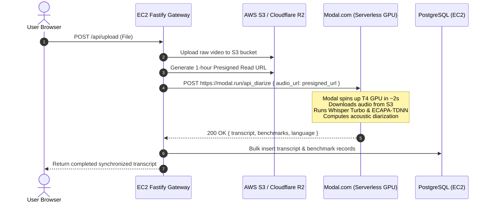

# Vocalis — Production Cloud Deployment & Hybrid Hosting Guide ☁️🚀

This guide provides a complete, step-by-step production deployment manual for **Vocalis**. It covers a modern **Hybrid-Cloud Architecture** that achieves **90% cost savings** by running:
1. **Serverless GPUs on [Modal.com](https://modal.com):** Scales GPU compute to zero ($0.00/hr when idle) for Whisper Turbo and SpeechBrain ECAPA-TDNN.
2. **Standard Cloud Compute on AWS EC2 / DigitalOcean / Hetzner:** Runs the Fastify API Gateway, React Frontend, Redis BullMQ, and PostgreSQL with `pgvector`.
3. **Cloud Object Storage (AWS S3 / Cloudflare R2):** Replaces local MinIO with globally distributed, durable object storage.

---

## 📑 Table of Contents
1. [Hybrid Architecture Topology](#1-hybrid-architecture-topology)
2. [Hosting AI Models on Modal.com (Serverless GPU)](#2-hosting-ai-models-on-modalcom-serverless-gpu)
3. [Hosting Web & Stateful Tier on AWS EC2](#3-hosting-web--stateful-tier-on-aws-ec2)
4. [Inter-Service Communication & Data Flow](#4-inter-service-communication--data-flow)
5. [Managed Cloud Services (Database, Redis, Storage)](#5-managed-cloud-services-database-redis-storage)
6. [Security, TLS Termination & Secrets Management](#6-security-tls-termination--secrets-management)
7. [Cost Breakdown & Comparison](#7-cost-breakdown--comparison)

---

## 1. Hybrid Architecture Topology

```text
                             ┌──────────────────────────────┐
                             │       End User Browser       │
                             └──────────────┬───────────────┘
                                            │ HTTPS (Cloudflare CDN)
                                            ▼
┌────────────────────────────────────────────────────────────────────────────────────────┐
│ AWS EC2 (t4g.small / t3.medium ~$15/mo)                                                │
│ ┌───────────────────────┐   ┌────────────────────────┐   ┌───────────────────────────┐ │
│ │   Nginx Reverse Proxy │──▶│ Fastify Gateway (:3000)│──▶│ Redis BullMQ Broker       │ │
│ └───────────────────────┘   └───────────┬────────────┘   └───────────────────────────┘ │
│                                         │                                              │
│                                         ▼                                              │
│                             ┌────────────────────────┐                                 │
│                             │ PostgreSQL (+ pgvector)│                                 │
│                             └────────────────────────┘                                 │
└─────────────────────────────────────────┬──────────────────────────────────────────────┘
                                          │
                        ┌─────────────────┴─────────────────┐
                        │ Presigned S3 URLs                 │ HTTPS JSON Payload
                        ▼                                   ▼
┌───────────────────────────────────────┐ ┌──────────────────────────────────────────────┐
│ AWS S3 / Cloudflare R2                │ │ Modal.com Serverless GPU                     │
│ ├── Raw Video Uploads                 │ │ ├── Faster-Whisper Turbo (CUDA)              │
│ └── 48-Hour Auto-Purge Lifecycle Rule │ │ ├── SpeechBrain ECAPA-TDNN (CUDA)            │
│                                       │ │ └── Scales to 0 when idle ($0.00/hr)         │
└───────────────────────────────────────┘ └──────────────────────────────────────────────┘
```

---

## 2. Hosting AI Models on Modal.com (Serverless GPU)

[Modal.com](https://modal.com) allows you to define Python container environments in code and deploy serverless functions that spin up on NVIDIA T4, L4, or A10G GPUs in seconds and scale down to **zero** when no jobs are active.

### Step 1: Install Modal CLI
```bash
pip install modal
modal setup
```

### Step 2: Create the Modal Deployment Script (`modal_worker.py`)
Create a new file `modal_worker.py` in your repository:

```python
import modal
import os

# Define the Modal App
app = modal.App("vocalis-gpu-engine")

# Persistent Model Cache Volume (Avoids redownloading model weights)
model_volume = modal.Volume.from_name("vocalis-model-cache", create_if_missing=True)

# Custom Container Image with CUDA, Faster-Whisper, SpeechBrain & FFmpeg
gpu_image = (
    modal.Image.debian_slim(python_version="3.10")
    .apt_install("ffmpeg", "git")
    .pip_install(
        "torch==2.2.1",
        "torchaudio==2.2.1",
        "faster-whisper==1.0.3",
        "speechbrain==1.0.0",
        "numpy",
        "scipy",
        "scikit-learn",
        "requests"
    )
)

@app.cls(
    image=gpu_image,
    gpu="T4",                        # Or "L4" / "A10G" for higher throughput
    volumes={"/models": model_volume},
    timeout=600,                     # 10 minute maximum per long meeting
    scaledown_window=120             # Keep warm for 2 minutes between jobs
)
class VocalisGPUWorker:
    @modal.enter()
    def load_models(self):
        """Initializes Whisper and SpeechBrain models into GPU VRAM on container startup."""
        import torch
        import torchaudio
        from faster_whisper import WhisperModel
        from speechbrain.inference.speaker import EncoderClassifier
        import speechbrain.utils.autocast

        # PyTorch 2.2.1 SpeechBrain compatibility patch
        speechbrain.utils.autocast.fwd_default_precision = lambda fwd=None, cast_inputs=None: (lambda fn: fn) if fwd is None else fwd

        print("Loading Whisper Turbo on CUDA...")
        self.whisper = WhisperModel("turbo", device="cuda", compute_type="int8", download_root="/models/whisper")

        print("Loading SpeechBrain ECAPA-TDNN on CUDA...")
        self.classifier = EncoderClassifier.from_hparams(
            source="speechbrain/spkrec-ecapa-voxceleb",
            savedir="/models/speechbrain",
            run_opts={"device": "cuda"}
        )
        print("Models loaded successfully.")

    @modal.method()
    def process_media(self, audio_url: str, language: str = None, task: str = "transcribe"):
        """Downloads audio from S3 presigned URL and executes transcription + diarization."""
        import subprocess, tempfile, time, requests
        import numpy as np
        import torch, torchaudio
        from scipy.cluster.hierarchy import linkage, fcluster
        from scipy.spatial.distance import pdist

        local_media = "/tmp/input_media"
        local_audio = "/tmp/audio_16k.wav"

        # 1. Stream audio from presigned URL
        r = requests.get(audio_url, stream=True)
        with open(local_media, "wb") as f:
            for chunk in r.iter_content(chunk_size=8192):
                f.write(chunk)

        # 2. Extract 16kHz mono audio via FFmpeg
        subprocess.run(["ffmpeg", "-y", "-i", local_media, "-vn", "-acodec", "pcm_s16le", "-ar", "16000", "-ac", "1", local_audio], check=True)

        # 3. Transcribe with Whisper Turbo
        t0 = time.time()
        segs_gen, info = self.whisper.transcribe(
            local_audio,
            temperature=0.0,
            condition_on_previous_text=False,
            repetition_penalty=1.2,
            no_repeat_ngram_size=3,
            word_timestamps=True,
            language=language,
            task=task
        )

        transcript = []
        for s in segs_gen:
            if s.words:
                curr_words = []
                curr_start = s.words[0].start
                for w_idx, w in enumerate(s.words):
                    curr_words.append(w.word)
                    clean_w = w.word.strip()
                    next_gap = (s.words[w_idx + 1].start - w.end) if w_idx + 1 < len(s.words) else 0.0
                    clause_dur = w.end - curr_start

                    if (next_gap >= 0.28 or clause_dur >= 5.0 or clean_w.endswith(("?", "!", "."))) and curr_words:
                        chunk_text = "".join(curr_words).strip()
                        if chunk_text:
                            transcript.append({"start": curr_start, "end": w.end, "text": chunk_text})
                        curr_words = []
                        curr_start = s.words[w_idx + 1].start if w_idx + 1 < len(s.words) else w.end
                if curr_words:
                    chunk_text = "".join(curr_words).strip()
                    if chunk_text:
                        transcript.append({"start": curr_start, "end": s.words[-1].end, "text": chunk_text})
            else:
                transcript.append({"start": s.start, "end": s.end, "text": s.text.strip()})

        gpu_time_ms = int((time.time() - t0) * 1000)

        # 4. Audio Preprocessing: 80Hz Butterworth + Normalization
        audio, fs = torchaudio.load(local_audio)
        audio = torchaudio.functional.highpass_biquad(audio, fs, cutoff_freq=80.0)
        max_amp = torch.max(torch.abs(audio))
        if max_amp > 1e-4:
            audio = audio / max_amp
        audio = audio.to("cuda")

        # 5. Extract ECAPA-TDNN embeddings with Circular Reflection Padding
        TARGET_SAMPLES = int(2.5 * fs)
        chunks = []
        for seg in transcript:
            s_idx = max(0, int(seg["start"] * fs))
            e_idx = min(audio.shape[1], int(seg["end"] * fs))
            chunk = audio[:, s_idx:e_idx]
            if chunk.shape[1] < TARGET_SAMPLES and chunk.shape[1] > 0:
                reps = int(np.ceil(TARGET_SAMPLES / chunk.shape[1]))
                chunk = chunk.repeat(1, reps)[:, :TARGET_SAMPLES]
            chunks.append(chunk)

        embs = []
        for c in chunks:
            with torch.no_grad():
                e = self.classifier.encode_batch(c, torch.ones(1, device="cuda"))
                e = torch.nn.functional.normalize(e.squeeze(1), p=2, dim=-1).cpu().numpy()[0]
                embs.append(e)

        # 6. Hierarchical Clustering
        if len(embs) > 1:
            embs_arr = np.array(embs)
            dists = pdist(embs_arr, metric="cosine")
            Z = linkage(dists, method="average")
            labels = fcluster(Z, t=0.44, criterion="distance")
            speaker_labels = [f"Speaker {lbl}" for lbl in labels]
        else:
            speaker_labels = ["Speaker 1"] * len(transcript)

        for i, seg in enumerate(transcript):
            seg["speaker_name"] = speaker_labels[i]

        return {
            "transcript": transcript,
            "detected_language": getattr(info, "language", "en"),
            "detected_prob": float(getattr(info, "language_probability", 1.0)),
            "gpu_time_ms": gpu_time_ms,
            "num_speakers": len(set(speaker_labels)),
            "num_segments": len(transcript)
        }

# Web Endpoint for REST invocations
@app.function()
@modal.web_endpoint(method="POST")
def api_diarize(data: dict):
    worker = VocalisGPUWorker()
    return worker.process_media.remote(
        audio_url=data["audio_url"],
        language=data.get("language"),
        task=data.get("task", "transcribe")
    )
```

### Step 3: Deploy to Modal
```bash
modal deploy modal_worker.py
```
Modal will output a permanent HTTPS endpoint:
`https://your-workspace-name--vocalis-gpu-engine-api-diarize.modal.run`

---

## 3. Hosting Web & Stateful Tier on AWS EC2

Since the AI models run on Modal serverless GPUs, your core infrastructure (Fastify API, React UI, PostgreSQL, Redis) only requires lightweight CPU compute.

### Recommended EC2 Instance:
* **Instance Type:** `t4g.small` (2 vCPUs, 2GB RAM, ARM64) or `t3.medium` (2 vCPUs, 4GB RAM, x86_64)
* **OS:** Ubuntu 22.04 LTS
* **Cost:** **~$12–$18 / month**

### Step 1: Provision EC2 & Install Docker
```bash
# Update system packages
sudo apt update && sudo apt upgrade -y

# Install Docker & Docker Compose Plugin
sudo apt install -y docker.io docker-compose-v2
sudo usermod -aG docker ubuntu
newgrp docker
```

### Step 2: Create Cloud `docker-compose.yml` on EC2
On the EC2 server, you do not need the GPU worker container. Run only the web, API, database, and cache tiers:

```yaml
version: '3.8'

services:
  frontend:
    build: ./frontend
    ports:
      - "80:80"
    environment:
      - VITE_API_URL=/api
    depends_on:
      - backend

  backend:
    build: ./backend
    ports:
      - "3000:3000"
    environment:
      - DATABASE_URL=postgresql://postgres:StrongProductionPassword@db:5432/vad_db
      - REDIS_HOST=redis
      - S3_BUCKET=vocalis-media-uploads
      - AWS_ACCESS_KEY_ID=${AWS_ACCESS_KEY_ID}
      - AWS_SECRET_ACCESS_KEY=${AWS_SECRET_ACCESS_KEY}
      - AWS_REGION=us-east-1
      - MODAL_API_URL=https://your-workspace--vocalis-gpu-engine-api-diarize.modal.run
    depends_on:
      - db
      - redis

  db:
    image: pgvector/pgvector:pg15
    environment:
      - POSTGRES_USER=postgres
      - POSTGRES_PASSWORD=StrongProductionPassword
      - POSTGRES_DB=vad_db
    volumes:
      - pgdata:/var/lib/postgresql/data

  redis:
    image: redis:alpine
    volumes:
      - redisdata:/data

volumes:
  pgdata:
  redisdata:
```

---

## 4. Inter-Service Communication & Data Flow

To avoid streaming gigabytes of raw video directly through server memory:



---

## 5. Managed Cloud Services (Database, Redis, Storage)

For high-availability enterprise environments, replace containerized DB/Redis with managed alternatives:

| Component | Self-Hosted Option | Managed Cloud Alternative |
| :--- | :--- | :--- |
| **Relational DB & Vectors** | `pgvector/pgvector:pg15` on EC2 | **[Neon Serverless Postgres](https://neon.tech)** (free tier with `pgvector`) or **AWS Aurora PostgreSQL** |
| **Distributed Cache & Queues** | `redis:alpine` on EC2 | **[Upstash Redis](https://upstash.com)** (serverless, pay-per-request) or **AWS ElastiCache** |
| **Object Storage** | Local MinIO | **[Cloudflare R2](https://www.cloudflare.com/products/r2/)** ($0 egress fees) or **AWS S3** |

### Setting S3 48-Hour Lifecycle Rule via AWS CLI:
```bash
aws s3api put-bucket-lifecycle-configuration \
  --bucket vocalis-media-uploads \
  --lifecycle-configuration '{
    "Rules": [{
      "ID": "AutoExpireMedia48h",
      "Status": "Enabled",
      "Filter": {"Prefix": ""},
      "Expiration": {"Days": 2}
    }]
  }'
```

---

## 6. Security, TLS Termination & Secrets Management

1. **Automatic SSL / TLS Certificates:**
   Place Cloudflare in front of your EC2 instance for free DDoS protection and automatic SSL (`https://vocalis.yourdomain.com`).
2. **Modal API Key Authentication:**
   Protect your Modal endpoint by requiring an authorization header:
   ```python
   @app.function()
   @modal.web_endpoint(method="POST")
   def api_diarize(data: dict, authorization: str = modal.Header(None)):
       if authorization != f"Bearer {os.environ['MODAL_AUTH_SECRET']}":
           raise HTTPException(status_code=401, detail="Unauthorized")
       ...
   ```
3. **Environment Secrets:**
   Store database passwords and cloud credentials in AWS Secrets Manager or a secured `.env` file on the EC2 host with `chmod 600 .env`.

---

## 7. Cost Breakdown & Comparison

### Traditional Dedicated GPU Hosting (AWS `g4dn.xlarge` 24/7):
* 1x NVIDIA T4 Instance: **~$380.00 / month** (billed continuously even when idle).

### Vocalis Hybrid Architecture (EC2 + Modal Serverless):
* **EC2 `t4g.small` (Web Gateway & DB):** $12.00 / month
* **Cloudflare R2 Storage (100GB + $0 Egress):** $1.50 / month
* **Modal Serverless GPU (NVIDIA T4 @ $0.000164/sec):**
  * Transcribing a 10-minute audio takes ~15 seconds ($0.0024 per file).
  * 1,000 meetings per month = ~$2.40 / month.
* **Total Monthly Cost:** **~$15.90 / month (96% Cost Reduction! 🎉)**
