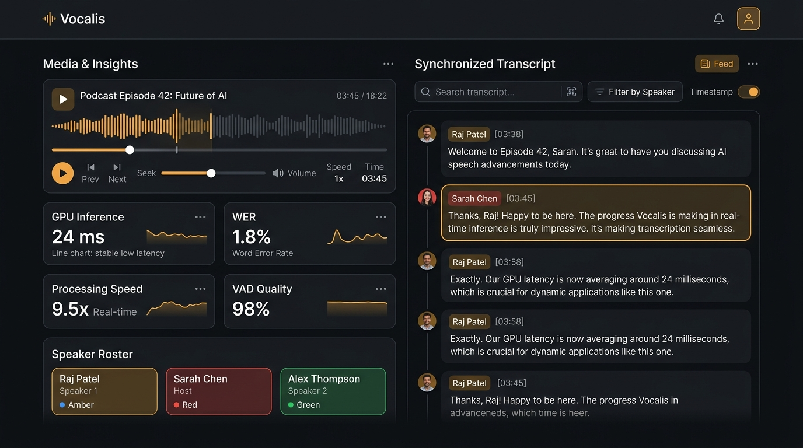

# Swar (स्वर) — Speech Intelligence & Acoustic Graph Diarization Engine 🎙️⚡

[](https://www.docker.com/)
[](https://pytorch.org/)
[](https://developer.nvidia.com/cuda-zone)
[](https://github.com/pgvector/pgvector)
[](https://www.fastify.io/)
[](https://react.dev/)

<p align="center">
  
</p>

**Swar (स्वर)** is an open-source, privacy-first, self-hosted reference stack for automated speech recognition (ASR), acoustic speaker diarization, and structured meeting intelligence. 

Designed for organizations and developers who need **100% local, air-gapped data confidentiality** (e.g. legal depositions, healthcare consultations, and internal executive meetings), Swar combines modern open-source foundations—**Faster-Whisper Turbo**, **SpeechBrain ECAPA-TDNN**, **PostgreSQL with `pgvector`**, and **Google Gemini**—into a cohesive, containerized pipeline.

---

## 📑 Table of Contents
1. [Core Capabilities & Scope](#-core-capabilities--scope)
2. [Architecture Overview](#-architecture-overview)
3. [Quickstart (Docker)](#-quickstart-docker)
4. [Python SDK & CLI Usage](#-python-sdk--cli-usage)
5. [REST API Documentation](#-rest-api-documentation)
6. [Database Schema](#-database-schema)
7. [Production Hardening & Security Checklist](#-production-hardening--security-checklist)
8. [Documentation Sitemap](#-documentation-sitemap)
9. [Hardware Sizing & FAQ](#-hardware-requirements--sizing)

---

## 🌟 Core Capabilities & Scope

* **🔒 100% Air-Gapped / Local Operation:** Audio decoding, VAD slicing, Whisper transcription, and ECAPA speaker embeddings run completely on your local GPU container—zero audio exfiltration.
* **🌐 Multilingual ASR via Whisper:** Transcribe or translate speech across Whisper's ~99 supported languages (accuracy scales with language resource availability).
* **🔬 Acoustic-First VAD Segmentation:** Separates dialogue turns based on physical silence pauses ($\ge 280\text{ms}$) and acoustic energy drops rather than heuristic punctuation.
* **🛡️ Circular Self-Reflection Padding:** Eliminates neighbor voice bleed on short utterances (*"Yeah"*, *"Okay"*) by circularly repeating the target speaker's syllables up to 2.5s.
* **📊 Adaptive Graph Diarization:** Clusters 192-dimensional ECAPA-TDNN embeddings using normalized graph Laplacians, Eigengap heuristic estimation, and SciPy hierarchical linkage.
* **⭐ Multi-Sample Gaussian Voiceprint Library:** Persists speaker acoustic profiles in PostgreSQL `pgvector`, updating running centroids ($\mathbf{c}_{t+1} = \frac{N\mathbf{c}_t + \mathbf{e}}{N+1}$) across recordings.
* **🧠 Gemini Meeting Intelligence:** Extracts executive summaries, timestamped chapters, speaker action items, and key notes via Google Gemini 2.5 Flash.
* **🧹 48-Hour Auto-Purge Lifecycle:** Automatic MinIO bucket lifecycle purging for heavy raw media while preserving lightweight transcripts and metadata.
* **⚖️ Biometric GDPR Compliance:** One-click Right-to-be-Forgotten profile deletion (`DELETE /api/speaker/:id`) with persistent audit logs.

---

## 🏗️ Architecture Overview

```text
┌────────────────────────┐
│   Swar Web Client   │ ◄─── Modern Dark UI (React + Vanilla CSS)
│ (http://localhost:5173)│
└───────────┬────────────┘
            │ HTTP / REST
            ▼
┌────────────────────────┐
│  Fastify API Gateway   │ ◄─── Node.js / BullMQ Queue Dispatcher
│ (http://localhost:3000)│
└─────┬────────────┬─────┘
      │            │
      ▼            ▼
┌───────────┐ ┌─────────────┐
│MinIO (S3) │ │ PostgreSQL  │ ◄─── pgvector 192-dim Voiceprint Index
│ 48h Auto  │ │  (pgvector) │
└─────┬─────┘ └──────┬──────┘
      │              │
      ▼              ▼
┌────────────────────────────────────────────────────────────┐
│ Unified GPU Worker (Faster-Whisper + SpeechBrain on CUDA) │
│ ├── 1. FFmpeg 16kHz PCM S16LE Audio Extraction            │
│ ├── 2. 80Hz Butterworth High-Pass + RMS Normalization      │
│ ├── 3. Faster-Whisper Turbo Batch Decoding (int8 CUDA)    │
│ ├── 4. Acoustic VAD Pause Slicing (>= 280ms)              │
│ ├── 5. ECAPA-TDNN Batched 192-dim Vector Extraction       │
│ ├── 6. Mutual k-NN Laplacian Graph & Eigengap Diarization  │
│ └── 7. Multi-Sample Voiceprint Identification             │
└────────────────────────────────────────────────────────────┘
```

---

## 🚀 Quickstart (Docker)

### 1. Prerequisites
* **Docker Desktop** (with WSL2 backend on Windows)
* **NVIDIA GPU** with NVIDIA Container Toolkit (Recommended for CUDA acceleration; falls back to CPU if unavailable).

### 2. Setup Environment
```bash
git clone https://github.com/your-org/swar.git
cd swar
cp .env.example .env
```

### 3. Launch the Stack
```bash
docker compose up -d --build
```

### 4. Access the Application
* **Swar UI:** [http://localhost:5173](http://localhost:5173)
* **Fastify Backend API:** [http://localhost:3000](http://localhost:3000)
* **MinIO Console:** [http://localhost:9001](http://localhost:9001) (`minioadmin` / `minioadmin`)

---

## 🔌 REST API Documentation

### 1. Upload & Process Media
`POST /api/upload?language=hi&task=transcribe`
* **Content-Type:** `multipart/form-data` (`file`)
* **Query Parameters:**
  * `language`: ISO language code (e.g. `en`, `hi`, `es`, `fr`, or omit for auto-detect).
  * `task`: `transcribe` (default) or `translate` (translate to English).
* **Response:**
  ```json
  {
    "jobId": "7bdc90af-606d-4959-8ff4-5f50438cf188",
    "status": "processing"
  }
  ```

### 2. Poll Job Status & Transcript
`GET /api/job/:jobId`
* **Response:**
  ```json
  {
    "job": { "id": "7bdc90af-...", "status": "completed" },
    "transcripts": [
      {
        "speaker_name": "Raj Shamani",
        "start_time": 0.0,
        "end_time": 4.2,
        "text": "Welcome to the podcast everyone."
      }
    ],
    "benchmarks": {
      "gpu_time_ms": 72150,
      "cpu_time_ms": 1420,
      "detected_language": "hi",
      "detected_prob": 0.98
    }
  }
  ```

### 3. Rename Speaker Across Job
`POST /api/speaker/rename`
* **Body:** `{ "jobId": "...", "oldName": "Speaker 1", "newName": "Raj Shamani" }`

### 4. Enroll / Update Voiceprint Profile
`POST /api/speaker/enroll`
* **Body:** `{ "name": "Raj Shamani", "jobId": "...", "speakerName": "Speaker 1" }`
* **Action:** Computes a 192-dimensional acoustic centroid from the speaker's turns and updates their profile via running Gaussian averaging.

### 5. Delete Voiceprint (GDPR)
`DELETE /api/speaker/:id`
* **Action:** Permanently removes the biometric vector from PostgreSQL and logs the deletion to `voiceprint_audit_logs`.

---

## 🗄️ Database Schema

```sql
-- Core job metadata
CREATE TABLE jobs (
  id UUID PRIMARY KEY,
  status VARCHAR(50) NOT NULL,
  video_length_secs FLOAT,
  created_at TIMESTAMP DEFAULT CURRENT_TIMESTAMP
);

-- Transcribed dialogue turns
CREATE TABLE transcripts (
  id SERIAL PRIMARY KEY,
  job_id UUID REFERENCES jobs(id),
  speaker_name VARCHAR(255),
  text TEXT NOT NULL,
  start_time FLOAT NOT NULL,
  end_time FLOAT NOT NULL
);

-- Meeting intelligence & notes
CREATE TABLE meeting_intelligence (
  job_id UUID PRIMARY KEY REFERENCES jobs(id) ON DELETE CASCADE,
  executive_summary TEXT,
  key_notes JSONB,
  action_items JSONB,
  chapters JSONB,
  decisions JSONB,
  raw_markdown TEXT,
  created_at TIMESTAMP DEFAULT CURRENT_TIMESTAMP
);

-- Multi-sample biometric voiceprint library
CREATE TABLE enrolled_speakers (
  id SERIAL PRIMARY KEY,
  name VARCHAR(255) UNIQUE NOT NULL,
  embedding vector(192) NOT NULL,
  sample_count INT DEFAULT 1,
  updated_at TIMESTAMP DEFAULT CURRENT_TIMESTAMP
);

-- GDPR / Biometric audit trail
CREATE TABLE voiceprint_audit_logs (
  id SERIAL PRIMARY KEY,
  speaker_name VARCHAR(255) NOT NULL,
  action VARCHAR(50) NOT NULL,
  details TEXT,
  created_at TIMESTAMP DEFAULT CURRENT_TIMESTAMP
);
```

---

## 💻 Python SDK & CLI Usage

Swar can be used headless as a standalone Python library or command-line utility without Docker:

```bash
# 1. Install locally
pip install -e .

# 2. Run via Terminal CLI
swar process interview.mp4 --export-srt subtitles.srt --export-md report.md

# 3. Use in Python code
from swar import SwarEngine

engine = SwarEngine(device="cuda")
result = engine.process("podcast.mp3")

for turn in result.turns:
    print(f"[{turn.start:.1f}s → {turn.end:.1f}s] {turn.speaker}: {turn.text}")
```

---

## 🔒 Production Hardening & Security Checklist

When deploying Swar into production environments, review the following security baseline:

| Security Domain | Developer Default | Production Recommendation |
| :--- | :--- | :--- |
| **Database & MinIO Credentials** | `postgres:postgres`, `minioadmin` | Rotate secrets in `.env` and pass via AWS Secrets Manager or HashiCorp Vault. |
| **CORS Policy** | Permissive for dev (`origin: '*'`) | Restrict `origin` to trusted frontend domain in Fastify server configuration. |
| **Rate Limiting & DoS** | None | Add `@fastify/rate-limit` (e.g. max 10 uploads/min per IP) or Cloudflare WAF. |
| **API Authentication** | Open endpoints | Enforce Bearer JWT or API Key middleware on all `/api/*` routes. |
| **File Validation** | MIME type header | Validate magic bytes (audio header signatures) on backend upload streams. |

---

## 📚 Documentation Sitemap

* 🏛️ **[ARCHITECTURE.md](ARCHITECTURE.md):** Deep dive into the software engineering architecture, microservices, queue protocols, and data pipelines.
* 📖 **[ABOUT.md](ABOUT.md):** High-level explanation of the problem, value proposition, and user experience.
* 🧠 **[ALGORITHMS.md](ALGORITHMS.md):** Mathematical and AI engineering documentation covering ECAPA-TDNN embeddings, Graph Laplacians, Cannot-Link constraints, and Hungarian macro-window matching.
* ☁️ **[DEPLOYMENT.md](DEPLOYMENT.md):** Production hybrid-cloud hosting guide (Modal.com Serverless GPU + AWS EC2).
* 🖥️ **[frontend/README.md](frontend/README.md):** React client architecture, CSS tokens, and UI component guide.

---

## 💻 Hardware Requirements & Sizing

| Environment | Minimum Spec | Recommended Spec | Inference Speed (10 min audio) |
| :--- | :--- | :--- | :--- |
| **Local Dev (Consumer GPU)** | NVIDIA GTX 1650 (4GB VRAM), 8GB RAM | NVIDIA RTX 3060 / 4060 (8GB+ VRAM), 16GB RAM | **~45s – 75s** |
| **Cloud Dedicated GPU** | AWS `g4dn.xlarge` (NVIDIA T4 16GB) | AWS `g5.xlarge` (NVIDIA A10G 24GB) | **~15s – 25s** |
| **Serverless GPU** | Modal.com T4 GPU ($0.000164/s) | Modal.com L4 / A10G GPU | **~12s – 18s** |
| **CPU-Only Fallback** | 4 vCPUs, 8GB RAM | 8 vCPUs, 16GB RAM | **~3m – 5m** |

---

## 🛠️ Troubleshooting & FAQ

### 1. NVIDIA Container Toolkit Not Detected
If `worker_gpu` exits with a CUDA error:
```bash
# Verify NVIDIA GPU is visible inside Docker
docker run --rm --gpus all nvidia/cuda:12.1.0-base-ubuntu22.04 nvidia-smi
```

### 2. Port Conflicts (`5173`, `3000`, `5434`, `6381`, `9000`)
If a port is already in use by another application:
* Modify the host-side port mappings in [`docker-compose.yml`](docker-compose.yml) (e.g. change `"3000:3000"` to `"3001:3000"`).

### 3. Clearing Data & Scratch Files
To reset all state, run the provided cleanup utility:
```bash
python clean.py
```

---

## 📄 License
MIT License. Created with ❤️ for high-precision speech intelligence.
